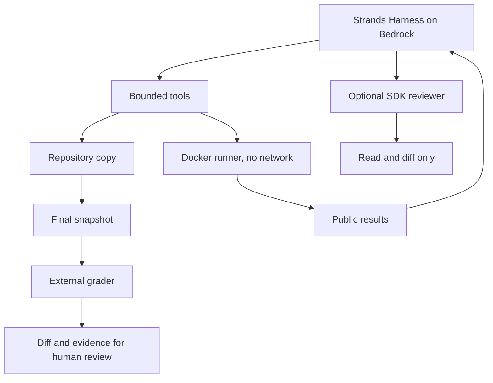

# Strands Repair Lab

An agent receives an issue and must prove it fixed it.

This lab gives a Strands Harness agent on Amazon Bedrock a small synthetic repository with a buggy HTTP retry client. The agent decides what to read, reproduces the failure, edits the code, runs the public tests, can ask a read-only reviewer for a second opinion, and submits a patch. An external grader with held-out cases decides whether the patch passes.

The runner never tells the agent which line to change and never gives it the solution. There is no commit, PR, merge, deployment or write to a real repository.

## Architecture



It is not a Swarm: one agent with a tool loop and an optional specialist. The Docker backend is code from this lab, not the SDK's `DockerSandbox`. The container only receives the implementation and inputs, never the acceptance expectations.

## Repository layout

| Path | Contents |
|---|---|
| `repairlab/` | Runner, agent and tools, Docker sandbox, workspace, launcher, sandbox validation, Bedrock smoke test and run summary. |
| `grader/` | Held-out acceptance cases, oracle, verifier and a reference solution (a control written by hand, not an LLM repair). |
| `fixtures/repo/` | The synthetic repository the agent repairs: issue, contract, history, buggy client and public cases. |
| `tests/` | Offline tests with a scripted model (no AWS, no Docker). |
| `scripts/tabulate_harness_experiment.py` | Tabulates the harness-defaults A/B experiment from a run log. |
| `task.json` | Task definition consumed by the runner. |

Run outputs are written to `runs/`, which is not versioned.

## Prerequisites

- Python 3.12.
- Docker with a running Linux daemon (on Windows, Docker Desktop in Linux mode; prefer WSL2 if bind mounts fail).
- AWS CLI v2 and a lab profile allowed to invoke the chosen Bedrock model. Candidate containers need no network.

## Step 1: environment

```bash
python3 -m venv .venv
.venv/bin/python -m pip install -r requirements.lock.txt
.venv/bin/python -m pip check
export PYTHONUTF8=1
.venv/bin/python -m unittest discover -s tests -v
```

On Windows PowerShell use `.\.venv\Scripts\python.exe` and `$env:PYTHONUTF8 = "1"`.

## Step 2: pin the image and validate isolation

```bash
docker pull python:3.12-slim
export REPAIR_IMAGE="$(docker image inspect python:3.12-slim --format '{{.Id}}')"
.venv/bin/python -m repairlab.validate_sandbox
```

Every later run uses the exact local image ID with `--pull never`. Validation does not call Bedrock: it runs the buggy code, the reference control, a false-green attempt (exit 0) and a user/mount/environment check. Expect `PASS` in `runs/sandbox-check.json`. If Docker fails, fix Docker; never run the candidate on the host or add `--privileged`.

## Step 3: check Bedrock access

```bash
export AWS_PROFILE=<lab profile> AWS_REGION=us-east-1
export BEDROCK_MODEL_ID=global.anthropic.claude-sonnet-4-6
.venv/bin/python -m repairlab.bedrock_smoke --allow-aws
```

The smoke test makes one billable call. No AWS roles or resources are created.

## Step 4: launch the agent

```bash
.venv/bin/python -m repairlab.launch --allow-aws
```

The launcher enforces a 900 s deadline. Each run gets a fresh ID and copies. Default budget: 24 model attempts shared with the reviewer, 60 tool calls, 8 edits and 6 public test runs (the runner uses one to confirm the baseline failure). Each container case is limited to 20 s, 128 MiB, 1 CPU and 32 processes. These are operational limits, not an exact spending cap; measure one run before launching batches.

Open `runs/<id>/manifest.json`, `events.json`, `agent.json` and `verdict.json`:

- `VERIFIED_CANDIDATE`: the proposed patch passed the external checks. It does not mean merge.
- `REJECTED`: the proposal and the failure are kept.
- `ERROR`: an execution error, not a repair.

Review the diff by hand: methods, status codes, number of requests, backoff, exceptions and budget.

## Step 5: negative control

```bash
.venv/bin/python -m repairlab.launch --allow-aws --no-edit --no-reviewer --max-calls 12
```

The agent can investigate but not edit, so it must not reach `VERIFIED_CANDIDATE`. An infrastructure `ERROR` does not prove the grader caught the missing repair; keep it separate from `REJECTED`.

Other options: `--harness-defaults` turns on the harness context defaults for the A/B experiment, and `python -m repairlab.summarize runs` summarizes completed runs.

## Cleanup

The Docker backend removes its containers after each case; on timeout the launcher removes only the containers labeled with its run. No AWS resources are created. Docker images and `runs/` folders remain until you delete them.

## Security

No credentials are stored in this repository. AWS credentials are never passed to the candidate container, which runs without network.
